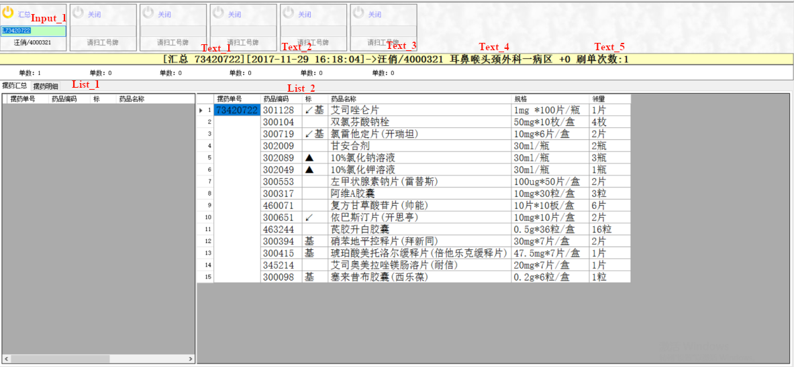

# 基于流程的可配置业务系统开发平台设计方案

## 一、设计目标

​		目前现有业务系统及开发方法与业务流程和逻辑是强关联的，当业务逻辑出现变化、亦或是重新开发一个业务逻辑时，需要对系统进行部分或全部重新设计和编码。针对较单一的业务应用，此方法可以实现与业务逻辑的紧密结合，在系统执行效率、业务整合度上提供较好的性能。但是，对于需要针对不同客户进行差异化部署的业务系统，此方法在开发过程和部署实施过程上需要投入比较多的时间和人力。因此，如何平衡业务系统对性能的要求和开发实施过程的简便快速是对系统设计的一个挑战。

​		事务性业务系统大多基于流程管理，根据不同业务逻辑和状态对业务数据进行输入、输出和流转。因此基于状态自动机原理的工作流引擎在系统开发过程中可以简化流程的设计和控制，使开发人员可以将更多精力聚焦在业务逻辑开发层面。

​		“可配置”即将系统设计在一定程度上将配置和代码分离，在不修改代码的前提下，实现系统设计的灵活性。“可配置”可以涉及数据、流程、用户界面，为业务系统在部署实施过程和后续业务调整提供足够的灵活性。但是，考虑“可配置”的粒度，会对整体系统设计思路影响较大。当粒度很小时，类比“乐高”积木，如果颗粒度细至一片一片的乐高积木，虽然可以提供充分的灵活性以满足各种“搭建”的需求，但实质是在创造另一个编程语言，或可称之为配置语言，本质上不是“低代码”的思路，而是重复造轮子。因此，对配置项的“颗粒度”的把握本质上是对设计复杂度和业务灵活性的平衡点的把握。

​		综上，基于流程的可配置业务系统开发平台的设计目标，可罗列如下：

- 使用基于状态自动机原理的工作流引擎，实现流程设计和控制
- 基于业务构件的设计思想，实现业务流程的设计和搭建
- 满足分布式部署要求的系统架构


## 二、整体设计

### 1. 控件 

“控件”定义为用户界面上一个基本交互单元，例如一个文本输入框、一个下拉列表框、一个按钮等等。每个控件有一个控件ID，在构件层面是唯一的（有关构件描述见下）。


### 2. 构件（页面）

“构件”定义为若干控件的组合，即我们通常意义上的“页面”，构件上除了交互控件，还可以包含文本、图片等静态信息。每个构件也有一个构件ID，是全局唯一的。

原则上构件对应一个页面及交互逻辑，但构件也可以没有页面，只是一个单纯的业务逻辑节点。


### 3. 数据流

数据流是控件与事件处理程序之间数据传递的内容。

- 输入数据流

  输入数据是面向构件的，在构件初始时产生，包含构件里所有控件和静态信息的初始数据，例如多选框的选项、构件上图片的链接地址等。输入数据流由构件在初始化时填充，在生成和展示控件时使用。

- 输出数据流

  输出数据也是面向构件的，在构件交互后产生的数据输出，包含构件中所有控件的数据录入。输出数据流由平台自动采集，由构件在事件处理中进行处理。


### 4. 事件

事件分两类：构件的事件、和控件的事件。事件的处理对应一段业务代码，在某个事件发生后，触发这段代码进行相应的业务处理。

#### （1）构件的事件

构件的事件主要有两个：

- 初始化事件

  在构件初始化时被调用，主要用于获取和填充输入数据流，或者为此控件的业务功能做前置准备，例如，相关的业务标志、锁、数据转换等等。

- 任务处理（构件结束）事件

  每个构件应该设置一个业务结束的控件事件，例如点击“确定”或“取消”按钮。当结束事件发生后，进入构件的业务处理事件程序。此时，平台已经将所有控件的输出数据汇总，形成输出数据流，这里应该对当前构件交互后产生的输出数据进行处理，及产生相应的状态，由工作流引擎依据状态控制进入下一个构件节点。

  

#### （2）控件的事件

控件的事件需要按控件的类型进行定义，不同类型的交互控件会有差异的事件定义，这里不一一列出。控件的事件会有默认的交互逻辑，例如文本输入框默认会将输入的文本存入输出数据流。因此，不需要对每一个控件事件都进行处理和编码，只有在需要的特定场景，尤其是需要及时对控件动作进行响应的场景，才需要进行控件事件的处理。例如，当输入框要求输入的是数字类型时，可以在输入框的处理事件里进行类型检查，不必等到构件处理事件时再进行检查。一般控件共有的常用事件可有以下几个：

- 初始化事件

  当构件初始化时，可能需要对构件上控件进行单独的初始化操作，可以在这里进行。在此时应该已经准备好构件的输入数据流，因此，可以在这里对当前控件的输入数据进行预处理。

- 输入焦点进入事件

  当界面上的交互控件获取到输入焦点时，会触发此事件。主要用于进行一些给常规的预处理动作。

- 输入焦点离开事件

  当界面上的交互控件即将失去输入焦点时，会触发此事件。主要用于对输入的数据进行即时的处理，可以实现Ajax的功能。

- 输入事件

  当交互控件出现输入行为时触发此事件。例如选择框选择了某个选项、输入框输入了文本等。


### 5. 流程

一个构件为一个业务节点，若干个业务节点组成一个流程，流程可以是顺序执行的，也可以有条件分支。一个节点执行完成后，根据其产生的状态，由工作流引擎决定下一个节点的流向。工作流引擎执行的依据是预先定义的各个业务流程。

因此，由上述控件、数据、页面构成的节点，配合预先定义的业务流程，就可以形成一个完整的业务（数据）处理流程，实现由初始输入数据到最终数据输出的一个过程。具体的业务逻辑分散在各个构件的事件处理程序中。


## 三、设计样例

使用一个简单的单节点的过程作为案例来说明上述设计。假设流程中有一个业务交互：药师输入摆药单号获取摆药明细。如下图的页面。



### 1. 控件

此设计中，只有一个交互控件：文本输入框```Input_1```。有5个静态文本```Text_1```～```Text_5```，即两个静态的列表```List_1``` 和```List2```。

### 2. 构件

因为只有一个页面，因此只有一个构件，可以命名为```Component_1```。

### 3. 数据流

- 输入数据流

  输入的数据流不用做处理，因为```Text```文本框的数据是根据输入后数据产生的。用```json```格式描述输入数据流如下：

  ```json
  {
      "component_id" : "Component_1",
      "controls" : [
          {
              "id" : "Input_1",
              "value" : ""
          },
          {
              "id" : "Text_1",
              "value" : ""
          },
          {
              "id" : "Text_2",
              "value" : ""
          },
          {
              "id" : "Text_3",
              "value" : ""
          },
          {
              "id" : "Text_4",
              "value" : ""
          },
          {
              "id" : "Text_5",
              "value" : ""
          },
          {
              "id" : "List_1",
              "value" : []
          },
          {
              "id" : "List_2",
              "value" : []
          }
      ]
  }
  ```

  

- 输出数据流

  输出数据流返回交互输入的数据，因为只有```Input_1```一个交互控件，因此只包含```Input_1```的内容。
  
  ```json
  {
      "component_id" : "Component_1",
      "controls" : [
          {
              "id" : "Input_1",
              "value" : "73420722"
          }
      ]
  }
  ```


### 4. 事件

#### （1）构件的事件

- 初始化事件

  不需要处理

- 任务处理事件

  这个案例中因为只有一个节点，因此任务处理事件不需要做什么。如果已经获取到正常的摆药单号，产生一个成功状态，例如```COMPLETED```，如果没有获取到正常的输入，可以产生一个失败的状态，例如```FAILURE```，然后由工作流引擎去处理去往下一个节点。

#### （2）控件的事件

这个案例控件的事件主要是```Input_1```的输入事件，要对输入进行检查和响应，主要体现在界面的交互上。

- 输入框的输入事件（一旦有输入就会触发）

  ```
  处理流程：
  1. 检查摆药单号的合法性（例如长度、数字等基本属性），通过合法才进行2
  2. 拿获取的摆药单号去查询明细（可能在此处访问数据库或缓存，也可能调用其他微服务）
  3. 如果获取到明细，继续4，如果失败，提示摆药单号错误
  4. 用查询到的数据更Text文本和List列表的响应内容
  ```

  

### 5. 流程

假设我们的流程设计只有一个节点，目的是获取一个有效的摆药单号码。当节点返回```COMPLETED```时，流程正常结束，当返回```FAILURE```时，异常结束。


## 四、技术实现的考虑

### 1. 工作流引擎

工作流引擎的选择比较丰富，开源的工作流引擎有很多。市场上比较有名的开源流程引擎有Osworkflow、Jbpm、Activiti、Flowable、Camunda。其中：Jbpm4、Activiti、Flowable、Camunda四个框架同宗同源，祖先都是Jbpm4，开发者只要用过其中一个框架，基本上就会用其它三个。

但上述引擎都属于通用型的工作流引擎，因此在部署实施方面相对比较“重”，从功能方面肯定都可以满足要求。如果考虑代码整合度、专有功能和执行效率等因素，自研或者二次开发一个工作流引擎也是一个值得考虑的选项。


### 2. 分布式架构

目前在实现分布式架构，主要采用B/S架构和前后端开发分离的方式，前端开发使用基于JS的框架，后端通过REST API提供服务，后端服务之间用RPC或REST进行服务的扩展。依赖不同编程语言的生态，各自有不同的框架可以选择，这里就不罗列。在设计时，需要考虑的几点：

- session共享。主要是考虑进行横向扩展时，服务器之间应该做到与session无关，这样横向扩展才不会受限，通常session放在一个共享的缓存中，例如Redis。
- DB的选择。DB的选择主要从两方面进行考虑，一方面，应该适合快速开发的扩展性要求，要能支持json结构存储，因为我们的系统设计是业务无关的，但在事件处理的编码中会体现业务逻辑，快速的业务开发和变更会要求经常性的修改（主要是增加）业务字段，而json结构比较适合，因为它的schema是应用定义的，不是DB定义的，灵活性非常高。当然也有缺点。另一方面，考虑DB的扩展性能，需要能比较容易的实现主从或集群方式部署，便于在需要的场景进行扩容。可参考的选择如，MongoDB、TiDB等。
- 工作流引擎的吞吐量。因为所有业务逻辑都要与工作流引擎进行交互，因为工作流引擎的吞吐量可能会是潜在的流量瓶颈，这也是追求工作流引擎“轻量化”的目的之一。


### 3. 可配置项

在此设计方案中，可配置的部分主要是各个构件及控件中的设置和逻辑。

- 配置项可以通过配置文件提供。流程、构件、控件等的配置描述可以使用```json```或```Yaml```格式；构件页面模板可以使用前端开发常见的模板，例如```Jinja```。
- 工作流引擎通过构件ID将构件与流程节点进行绑定；构件通过控件ID将控件与输入/输出数据流进行绑定。
- 按如上设计方法，构件节点是业务强相关的，例如，药物闭环的摆药单输入节点与病理闭环的样本号输入节点是两个不同的构件，需要配置两个不同的节点。
- 如要实现业务弱相关，以上述摆药单输入流程为例，进一步进行业务抽象，将输入合法性检查和数据查询都用API服务实现，就可以把API服务作为配置项放在构件的配置文件中，根据构件的使用场景决定是调用摆药单的查询API，还是病理样本的查询API。这样可以实现构件的重用。缺点是会损失一定性能，增加服务设计的复杂性。


### 4. 可视化

可视化可以为流程设计提供直观的流程展示和理解，某些开源工作流引擎已经提供了相应的可视化工具。但可视化并不是最重要的选项，一是因为，业务系统开发的核心逻辑是在构件的事件处理程序中，可视化对此帮助并不大，并且可视化并不能提升工作流引擎的性能，只是提升了用户体验，而此处的“用户”更多的是我们自己的专业实施人员，而不是最终客户。而且可视化功能的实现可能会消耗很大的开发工作量。因此，不建议在系统设计初期就具备可视化能力，可以在后续不断完善中，逐渐完善可视化功能。